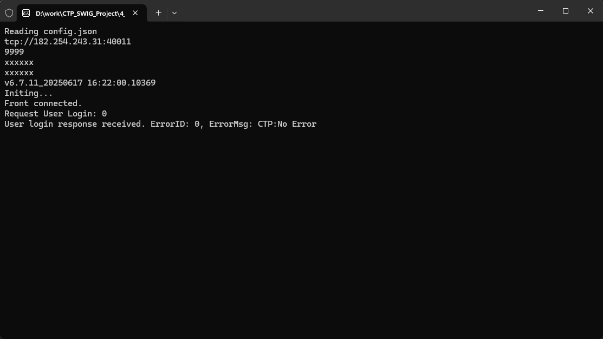

# CTP SWIG Project

use [**swig**](https://www.swig.org/) to generate C++ wrapper for CTP API

## Steps

1. copy latest [**ctp_api**](https://www.simnow.com.cn/static/apiDownload.action) to `.\1_CTP_Api`
2. run `.\2_SWIG_Work\build.bat` (*prepare [**swig**](https://www.swig.org/) environment before running this script*)
3. build `.\3_Final_DLL\CTP_Wrapper.sln`
4. run `.\4_TestCSharpProject\copy.bat`
5. run `.\4_TestCSharpProject\Test.sln`

## Preview

## Reference

> **CTP-CSharp** : https://github.com/ggwhsd/CTP-CSharp/tree/master